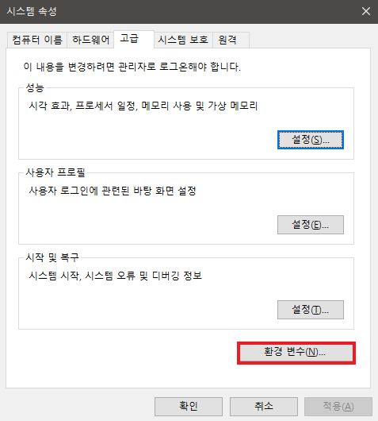
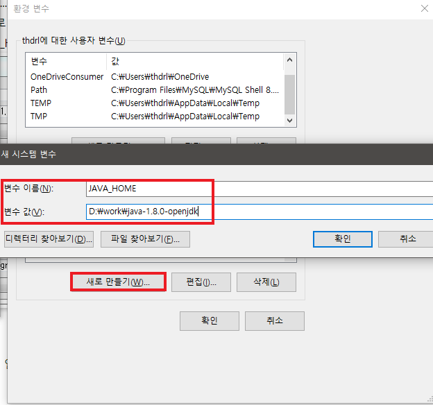
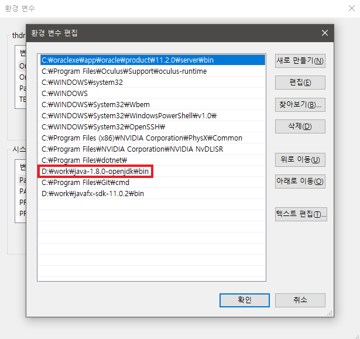

# 1. 개발환경 구축
---

1. [JDK(Java Development Kit) 설치](https://openjdk.java.net/) (8버전 설치함)  

    ```
     기본적으로 java 개발을 하기위해서는 JDK가 설치되어 있어야 하고
     보통 많이 사용하는 버전이 1.8버전이기 때문에 8버전을 설치
    ```


2. 환경 변수 설정

    ```
    javac.exe, java.exe를 다른 디렉토리에서도 실행할 수 있도록 
    환경변수(path)에 bin 경로를 넣어준다.

    1. 환경변수 편집기에 들어가서 시스템 변수에 JAVA_HOME이라는 
    변수를 추가한다(java 파일경로)

    2. 시스템 변수중 path라는 변수를 찾아 java폴더안 bin 경로를 추가해준다

    3. CMD창에 java -version 입력, 버전 확인을 한다
    ```









3. IDE 설치

    ```
    자바 개발시 가장많이 사용하는 이클립스IDE나 
    스프링에서 만든 이클립스 기반 STS4를 설치한다

    sts4 설치시 sts3 add-on 설치해야 
    Spring Legacy Project 로 프로젝트 생성이 가능하다
    ```

* [이클립스설치](https://www.eclipse.org/downloads/)  
혹은
* [STS4설치](https://spring.io/tools)(나는 이거 설치)

4. WAS

    ```
    WebProject 실행을위한 WAS중 아파치 톰캣 다운로드 
    9버전 받음
    ```

[톰캣링크](http://tomcat.apache.org/)

# 2. 프로젝트 생성
---


