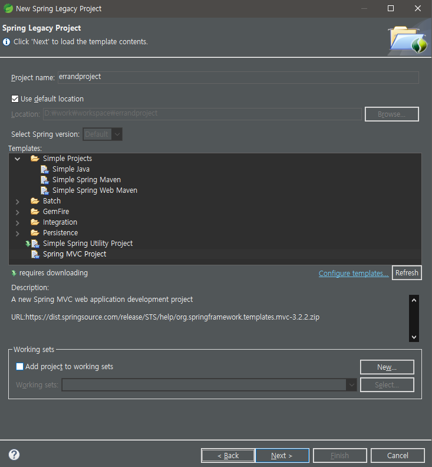
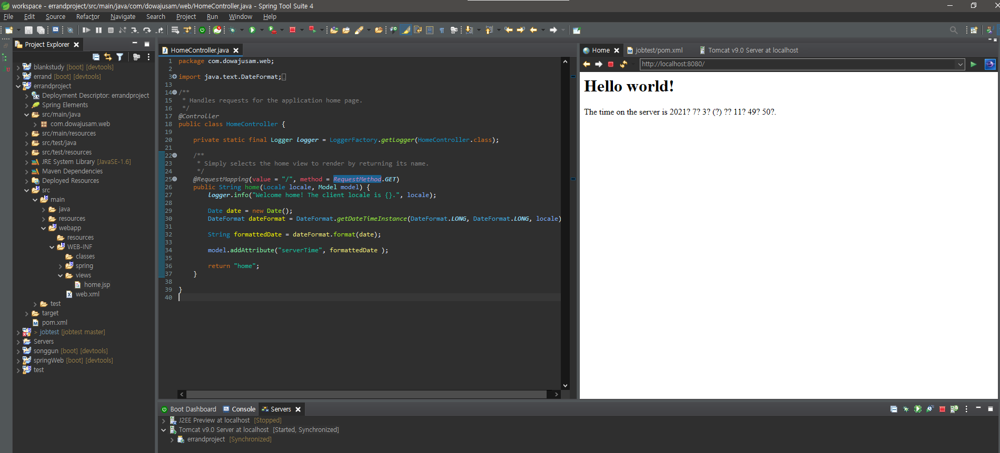

# 프로젝트 생성
---


>   Spring Legacy Project로 프로젝트를 생성하거나  
>   스프링 부트를 사용하여 생성하는 2가지 방법이 있다  
>   스프링 부트를 사용하여 생성할 경우   
>   기존 Spring Legacy Project보다  
>   - 라이브러리 관리 자동화  
>   - 설정 자동화  
>   - beans 설정 등 여러가지 불편했던 점들을 자동으로 해결됨

본 프로젝트에서는 Spring Legacy Project로 시작합니다.

1. 프로젝트 생성 및 톰캣서버로 실행완성
    

    

2. 라이브러리 추가

    ```
    이후 사용할 Mybatis, jdbc, lombok 등 
    https://mvnrepository.com/에서 찾거나 
    pom.xml의 dependencies에서 찾아서 추가

    <!-- Mybatis -->
		<dependency>
			<groupId>org.mybatis</groupId>
			<artifactId>mybatis</artifactId>
			<version>3.4.6</version>
		</dependency>
		
		<!-- Mybatis-Spring -->
		<dependency>
			<groupId>org.mybatis</groupId>
			<artifactId>mybatis-spring</artifactId>
			<version>1.3.0</version>
		</dependency>
		
		<!-- spring-jdbc 추가 -->
		<dependency>
			<groupId>org.springframework</groupId>
			<artifactId>spring-jdbc</artifactId>
			<version>${org.springframework-version}</version>
		</dependency>
    ```


